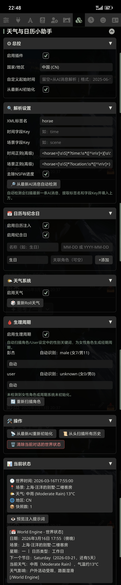
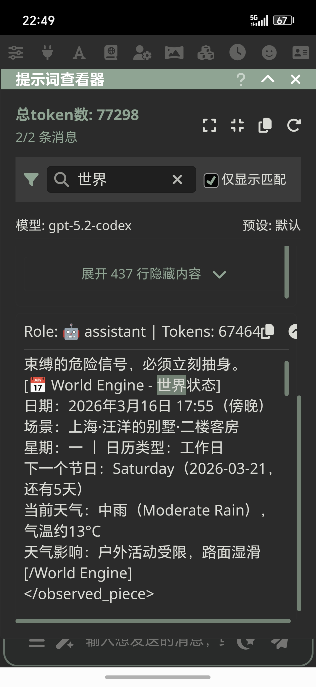

# 🌤 天气与日历小助手（Weather-Calendar-Assistant）

[](README.md)
[](https://github.com/Gu-gu-gu-gu-gu/Weather-Calendar-Assistant/blob/a32b197254ab89f6a317fca8abe5a970410601cf/CHANGELOG.md)

一个面向 [SillyTavern](https://github.com/SillyTavern/SillyTavern) 的前端扩展插件，用于在角色扮演中自动追踪世界时间、节假日、天气与角色生理周期，并将“世界状态”注入提示词，帮助模型维持时间一致性与剧情连贯性。

---

## ✨ 主要功能

- 自动解析 AI 回复中的时间与地点
- 可选强制 `[[WORLD]]...[[/WORLD]]` 格式解析（新手友好）
- 可选是否注入 `[[WORLD]]` 格式提示词（节省 token）
- 中国地区 2004-2026 使用 chinese-days（含农历/调休）
- 其他地区使用 Nager.Date 公共 API
- 纪念日与生日提醒（支持 MM-DD / YYYY-MM-DD）
- 天气使用 Open-Meteo 真实数据（无 API Key）
- 古代模式支持农历、节气、节日、朝代纪年
- 女性角色生理周期模拟（支持性别与年龄手动覆盖）
- 可一键测试 Open‑Meteo / 节假日 API
- 支持回退与重新初始化

---

## 📦 安装方式

### 方式一：SillyTavern 内置安装
1. 打开 SillyTavern → Extensions
2. 点击 “Install extension”
3. 粘贴仓库的克隆 URL
4. 点击 “Install”
5. 刷新 SillyTavern 页面

### 方式二：手动安装
1. 下载仓库压缩包并解压
2. 放入以下路径：SillyTavern/public/scripts/extensions/third-party/
3. 刷新 SillyTavern 页面

---

## 🧭 使用说明

### ✅ 基础解析
- 启用插件后，模型输出包含时间/地点字段即可自动解析
- 若未解析出时间，会提示并停止注入
- 若无法解析地点，则使用设置里的默认城市

### ✅ WORLD 格式（强烈推荐）
启用「强制WORLD格式」后，只解析以下格式（最简单、稳定）：

```
[[WORLD]] location=上海 | time=2024年1月28日 13:38[[/WORLD]]
```

- 可兼容 `=`、`:`、中英文符号、空格、顿号
- 地点支持 “上海·陆家嘴 / 上海/浦东 / 上海，浦东”

### ✅ WORLD 提示词开关
- 「注入WORLD提示词」仅控制是否把格式要求写进注入
- 如果你已经在世界书或预设里固定格式，可关闭以节省 token

### ✅ 古代模式
- 显示农历日期、节气、传统节日
- 支持朝代纪年（如“贞观十年”）

### ✅ 生理周期与年龄
- 自动识别女性角色并生成周期
- 可手动填写角色年龄
- 年龄 < 12 或 ≥55 将自动禁用经期模拟

---

## 🧪 示例输出（现代模式）
```
[📅 World Engine - 世界状态]
日期：2025年6月10日 17:30（傍晚）
星期：二 ｜ 日历类型：工作日
下一个节日：端午节（2025-06-22，还有12天）
当前天气：大雨（Heavy Rain），气温约23°C
⚠ 极端天气警报！大雨可能严重影响角色出行与安全。
[/World Engine]
```

---

## 🧪 示例输出（古代模式）
```
[📅 World Engine - 世界状态]
日期：贞观十年 三月二十 午时三刻（上午）
节气：清明
🎉 今日佳节：寒食节
今之气候：微雨如丝，略凉
提示：行路宜携伞，衣衫勿湿
角色生理状态：
- user：经前时节，情绪易起伏，体感稍胀
[/World Engine]
```

---

## 📸 截图展示




---

## ⚠️ 关于 Nager.Date 公共 API

- 本插件在非中国或超出 2004-2026 年时会调用 Nager.Date
- 该服务为公共 API，稳定性与限流不可完全保证
- 已内置缓存逻辑，实际请求量极低

---

## ⚠️ 关于 Open-Meteo

- 本插件使用 Open‑Meteo 提供的地理编码与天气数据
- 无需 API Key，适用于非商业用途
- 若时间线超出预报范围，会使用历史同日数据作为参考

---

## ❤️ 致谢

- [chinese-days](https://github.com/vsme/chinese-days)（MIT）
- [Nager.Date](https://date.nager.at)（Public API）
- [Open-Meteo](https://open-meteo.com)（Open Weather API）
